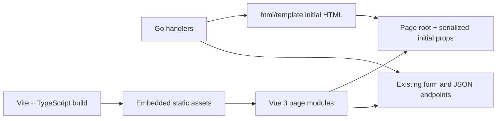

# Web Console Vue 渐进迁移技术设计

**Status:** proposed

## Architecture

Go 与 Vue 的 seam 是页面根节点、序列化初始属性以及既有 HTTP 契约。Go 是业务与持久化状态的权威；Vue 只拥有当前页面的临时交互状态。筛选等需要分享、刷新或后退恢复的状态继续落在 URL 或服务端响应中。

## Source and Build Layout

- Vue/TypeScript 源码放在 `internal/web/frontend/`。
- Vite 生成单一生产入口及必要样式到 `internal/web/static/dist/`，由现有 `embed.FS` 随 Go 二进制打包。
- 构建文件名保持确定，避免为当前单入口增加 manifest 解析模块。
- `npm run build:web` 执行类型检查与 Vite 构建；`make test/build/package/pr-check` 在 Go 编译前依赖该目标。
- CI 和 release workflow 增加 Node 22 与 `npm ci`；运行时和发布包不包含 Node。
- 开发模式优先使用 Vite watch 输出到现有静态目录，由 Go 继续提供页面和资源；暂不增加代理、SSR 或前端开发服务器路由分支。

Vite 官方提供后端集成模式，但当前项目只有一个嵌入式入口，不先引入 manifest 解析和开发代理：[Vite Backend Integration](https://vite.dev/guide/backend-integration.html)。当真实需求出现多入口、长期缓存或按页拆包时再升级。

## Frontend Modules

入口读取根节点的 `data-page`，只挂载当前页面模块。初始属性通过 `application/json` script 或 `data-*` 提供；复杂结构使用 JSON，短标量使用 `data-*`。模板不得把可执行脚本字符串拼进属性。

页面模块按用户流程划分，而不是按按钮类型拆成大量浅模块：

- `theme`：首次绘制前解析偏好；Vue 只渲染设置控件。
- `scan-create`：字段可见性、默认选择、校验导航和提交状态。
- `workbench`：页签、筛选、候选动作、证据 dialog 和反馈。
- `report`：筛选 popover、活动条件、视图与命令 dialog。
- `run-detail`：轮询、阶段、日志视图和取消反馈。

只有两个页面出现相同行为后才提取共享模块。原生 `details`、`dialog`、radio、表单校验和 CSS sticky 能满足时继续使用原生能力。

## State Ownership

| 状态 | 权威所有者 | 持久化 |
|---|---|---|
| Project、Zone、Run、Finding、Verification | Go/domain/store | 数据库 |
| 报告筛选与视图 | URL + Go handler | 查询参数 |
| 主题偏好 | 浏览器 | `localStorage` |
| 当前 popover/dialog/tab | Vue 页面模块 | 不持久化；必要时 URL hash |
| 扫描表单草稿 | 原生表单/Vue | 默认不跨会话持久化 |
| Run 实时状态 | Go API | Vue 只缓存最新响应 |

不复制业务校验到前端作为权威规则。前端可做即时提示，但服务端仍验证所有输入并返回可定位错误。

## Theme Boot

主题解析发生在主样式加载前的最小内联脚本中：读取 `system/light/dark` 偏好，结合 `matchMedia` 设置根节点主题与 `color-scheme`。该脚本保持无框架、无网络依赖，避免等待 Vue bundle 后才切换外观。Vue 设置控件调用同一小接口并监听系统主题变化。

## Migration Rule

每个页面切片遵循“替换，不叠加”：

1. 先以 Go handler/浏览器测试固定现有业务契约和已批准的新行为。
2. Vue 模块接管该区域全部交互状态。
3. 模板移除该区域的内联事件与旧 `data-*` 副作用 hook。
4. 删除 `app.js`/`workbench.js` 中被替代的逻辑及只验证实现细节的旧测试。
5. 通过明暗主题、键盘路径、浏览器 smoke 和全量质量门禁后完成 ticket。

在同一区域保留 Vue 和旧脚本双向同步不被允许。迁移期间未触及页面可以继续使用现有原生脚本。

## Verification

- `vue-tsc --noEmit`：Vue 与 TypeScript 类型检查。
- `vite build`：生产构建与嵌入产物生成。
- Go handler tests：路由、字段、查询参数、错误和响应契约。
- 现有 Playwright smoke：关键用户路径、主题、键盘、焦点和回归行为。
- 纯函数只有出现非平凡分支时才增加聚焦单元测试；暂不增加第二套组件测试框架。
- 每个 ticket 运行聚焦检查，完成前运行 `make pr-check` 与 `code-review`。

## Rollback

每个页面切片独立提交且不改变数据库。回滚恢复该页旧模板/脚本和前一版静态产物即可。主题偏好无法识别时按 `system` 处理；旧浏览器存储不会阻止页面启动。
