# AnchorScan AI 编码工作流审查

- 审查日期：2026-07-28
- 审查范围：项目级 Agent 指令、Trellis 生命周期、Codex/Pi 集成、计划与票据、测试与评审门禁、GitHub CI/分支保护、近期实际任务样本
- 审查方式：静态文件审查、Trellis/Codex 钩子手工探测、任务校验命令、Git/GitHub 只读状态核对
- 总体评级：**C（53/100）——框架完整，但关键保障主要依赖提示词自律，尚未形成可信的强制闭环**

## 1. 执行摘要

AnchorScan 已经具备一套相当成熟的 AI 开发“设计稿”：

- 根级 `AGENTS.md` 明确了计划、TDD、双轴评审、测试分层和领域文档入口；
- `CONTEXT.md`、ADR、`docs/plans/`、本地 ticket 和 `.trellis/spec/` 提供了较丰富的持久上下文；
- Trellis 覆盖计划、实现、检查、归档、日志和跨会话恢复；
- `Makefile` 提供稳定质量命令，PR CI 包含测试、构建、打包、浏览器 smoke 和依赖安全检查；
- Codex/Pi 代理都具备递归保护和任务上下文装载协议。

但实际控制面存在四个高风险断点：

1. **`main` 无分支保护、无 ruleset，近期提交均无关联 PR；而 PR 质量 workflow 只在 `pull_request` 触发。** 因此直接提交到 `main` 可以完全绕过 `make pr-check` 和安全检查。
2. **`docs/plans/` 与 Trellis 出现真实状态分叉。** 权威达梦计划仍为 backlog，并要求先创建 ready ticket；同一工作已经由 Trellis 标记完成、归档并提交。
3. **根规则要求的 TDD 与独立双轴 `code-review` 没有进入 Trellis 默认状态机。** 当前 `trellis-check` 是可写、自修复检查器，不能替代独立只读评审。
4. **任务就绪和完成条件没有程序化执行。** `task.py start` 不校验规划产物或上下文清单，`task.py validate` 将 0 条上下文显示为通过，`task.py archive` 不检查验收、测试、评审、分支或提交证据。

近期归档任务已经证明这些不是理论风险：

- 3/3 个归档任务的 `branch`、`worktree_path`、`commit`、`pr_url` 均为空；
- 3/3 个归档任务仍保留未勾选清单项；
- 达梦任务的 `implement.jsonl` 和 `check.jsonl` 都只有 seed 行，但仍被标记完成；
- 最近抽查的 5 个产品提交均直接位于 `origin/main`，GitHub API 返回 “no associated PR”。

结论：**现有 harness 适合辅助有纪律的人或 Agent，但还不能阻止失控的 Agent。** 最优先工作不是增加更多提示词，而是把已有规则变成分支、任务状态机和 CI 的不可绕过门禁。

## 2. 评分

| 维度 | 得分 | 结论 |
| --- | ---: | --- |
| 上下文与入口指令 | 9/10 | 根入口、领域词汇、ADR 和测试文档清晰 |
| 计划与任务治理 | 8/15 | 两套体系均较完整，但权威关系已发生实际分叉 |
| 测试与 TDD 设计 | 11/15 | 测试分层和稳定命令优秀，TDD 未进入 Trellis 强制流 |
| 评审独立性 | 4/15 | 有检查代理，但缺少根规则要求的独立双轴评审 |
| 自动化与强制执行 | 6/20 | 大量门禁停留在 Markdown；主分支可绕过 CI |
| 可追溯性 | 5/10 | 有 journal/任务归档，但任务缺提交、PR、验收和评审结果 |
| CI 与发布 | 10/15 | PR/Release workflow 本身较强，但没有合并前强制力 |
| **总分** | **53/100** | **规则质量高，执行可信度不足** |

## 3. 做得好的部分

### 3.1 根级执行契约清晰

`AGENTS.md:7-13` 区分了高风险行为变更与轻量修改，明确要求 plan → implement → TDD → code-review，并规定 ticket 只能在验证和评审后完成。`AGENTS.md:24-26` 又把测试、票据和领域文档入口集中起来，降低了首次探索成本。

### 3.2 测试分层是项目当前最成熟的门禁设计

`docs/testing-strategy.md:5-16` 以“最低充分 seam”分配单元、handler、Store、浏览器、真实工具和打包测试；`docs/testing-strategy.md:44-52` 定义了稳定命令。`Makefile:21-79` 将这些能力收敛为 `make test`、`make pr-check` 和 `make e2e`。

`make pr-check` 实际覆盖：

- Go 和 JavaScript 测试；
- Markdown 链接；
- DOCX 测试；
- Web 类型检查与构建；
- 发布包内容与解包 smoke；
- Playwright Chromium smoke。

`.github/workflows/pr.yml:42-46` 还会运行 `make pr-check` 与 `make security-check`。Actions 使用固定 SHA，`scripts/workflow_test.go:15-84` 对固定引用和发布资产做了回归检查。

### 3.3 Trellis 上下文隔离与代理递归保护较完善

`.trellis/workflow.md:223-240` 明确主会话与子代理职责，要求 dispatch prompt 带活动任务路径。`.codex/agents/trellis-implement.toml:10-13` 和 `.codex/agents/trellis-check.toml:10-13` 阻止代理递归派生 implement/check。Codex `SubagentStart` 钩子还禁用了跨会话单任务 fallback，降低了读取其他窗口任务的风险。

### 3.4 规则更新和生成文件漂移可观测

`trellis update --dry-run` 能区分未变文件、用户修改文件与用户数据。本次观察到：

- 项目 Trellis 版本：0.6.9；
- 本地 CLI：0.6.9；
- npm 最新：0.6.10；
- 89+ 个托管文件未变；
- `AGENTS.md` 被正确识别为用户修改，不会被静默覆盖。

## 4. 主要发现

### BH-01 — Critical：`main` 可直接写入，PR 质量门禁可被完全绕过

**证据**

- `.github/workflows/pr.yml:3-4` 只监听 `pull_request`。
- `.github/workflows/pr.yml:42-46` 中的 `make pr-check` 和 `make security-check` 仅在 PR workflow 内运行。
- GitHub API 对 `main` branch protection 返回 `404 Not Found`。
- GitHub rulesets 数量为 `0`。
- 2026-07-28 抽查提交 `0fe6a77`、`6a31c75`、`2633927`、`ee9bfb5`、`e69b8cd`，均无关联 PR。
- 当前 `HEAD -> main -> origin/main`，近期产品提交、Trellis archive commit 和 journal commit 都直接出现在 `main` 历史中。
- `.trellis/tasks/archive/2026-07/07-28-01-dameng-mvp/task.json:15-19` 显示 `branch`、`worktree_path`、`commit`、`pr_url` 均为空。

**影响**

Agent 可以在未运行 PR CI、没有独立评审、没有批准合并的情况下直接改变生产分支。由于 release workflow 在 tag push 后才运行，发布失败会成为第一道真实的远端综合门禁，而不是最后一道门禁。

2026-07-28 审查时点的 Actions 观察也符合这一模式：最近列表中没有 PR workflow，连续出现多个 tag-triggered release failure；当时 `v2.0.2` release 仍在运行。Release workflow 能阻止失败制品发布，但发生得太晚。

**建议**

1. 为 `main` 启用 branch protection 或 repository ruleset：
   - 必须通过 PR；
   - 必须通过 `quality-gate`；
   - 至少 1 个批准；
   - 禁止 force push 和删除；
   - 管理员同样受约束。
2. 暂时在 `.github/workflows/pr.yml` 增加 `push: branches: [main]` 作为兜底，但不能替代 PR 保护。
3. 只允许从已通过 required checks 的 `main` 提交创建 release tag。
4. 在 Trellis `task.py start` 中拒绝在 `main` 上启动行为变更任务；要求已记录 task branch、base branch、fixed point 和 worktree。

**验收**

- 直接 push `main` 被 GitHub 拒绝；
- 未通过 `quality-gate` 的 PR 无法合并；
- Trellis 行为任务在 `main` 上执行 `task.py start` 返回非零；
- task metadata 能记录 branch、fixed point、最终 commit 和 PR URL。

### BH-02 — Critical：权威 `docs/plans/` 与 Trellis 已发生实际状态分叉

**证据**

- `AGENTS.md:17-19` 规定已有 `docs/plans/` 和本地 issue tracker 保持权威，不得未经批准迁移或复制到 Trellis。
- `docs/plans/dameng-default-password/spec.md:3-5` 仍标为 backlog。
- 同一文件 `:89-94` 要求先创建 `tickets/01-dameng-default-password-detector.md`，用户确认后置为 `ready-for-agent`，再按 fixed point → implement → tdd → code-review → done 实施。
- 实际不存在该 ticket。
- `.trellis/tasks/archive/2026-07/07-28-01-dameng-mvp/task.json:4-18` 显示“达梦数据库默认口令检测 MVP”已于同日完成并归档。
- 对应提交 `e69b8cd` 已在 `main`：`feat: detect Dameng DB default password with active protocol fingerprinting`。
- Trellis PRD 与 backlog spec 的目标、触发条件、默认凭据、涉及模块高度一致，属于同一工作，而不是无关任务。

**附加漂移**

- 权威 spec `docs/plans/dameng-default-password/spec.md:34` 明确 `12345` 应继续保留在高危端口表；
- Trellis PRD `.trellis/tasks/archive/2026-07/07-28-01-dameng-mvp/prd.md:21` 写成“移除错误端口 `12345`（如有）”。

这说明复制计划不只造成状态漂移，也已经造成需求语义漂移。

**影响**

下一个 Agent 会把已实现功能当作 backlog 再次排期，或按照旧 spec 修改已经交付的行为。更严重的是，Agent 无法可靠判断哪套验收状态是真实的。

**建议**

1. 立即对齐达梦计划：
   - 根据实际实现更新权威 spec；
   - 创建或补录 ticket 验收与评审证据；
   - 修正状态并归档，或明确剩余差距后保留 active。
2. 对已有 `docs/plans/` 工作，Trellis task 不再复制 PRD；只保存指向权威 spec/ticket 的 `source_plan`、`source_ticket` 和执行上下文。
3. 在 `task.py start` 增加项目级 hook：
   - 若任务关联 `docs/plans/**`，要求 ticket 为 `ready-for-agent`；
   - 若发现同名/同范围 backlog spec 而未关联，拒绝启动并提示绑定。
4. 完成时由单一命令同时更新 ticket 状态、Trellis metadata 和提交/PR 引用，避免双写。

**验收**

- 任一活跃功能只存在一个需求/验收 source of truth；
- `docs/plans/` ticket 状态与 Trellis 状态可机械核对；
- CI 能发现“已完成 Trellis task 对应 backlog/done 未同步”的漂移。

### BH-03 — High：根规则要求的 TDD 和独立双轴评审没有进入默认 Trellis 流程

**证据**

- `AGENTS.md:8` 要求高风险变更执行 plan → implement → TDD → code-review。
- `docs/agents/issue-tracker.md:19-24` 要求：
  - 记录 `main` fixed point；
  - 在最低充分 seam 保留 red-green 证据；
  - 执行 Standards / Spec 双轴 `code-review`；
  - 修复 blocker/high 后才能 done。
- `.trellis/workflow.md:225-240` 的实际流程为：
  - `trellis-implement`；
  - `trellis-check`；
  - `trellis-update-spec`；
  - commit；
  - finish-work。
- `.trellis/workflow.md:473-555` 没有 TDD/red-green 步骤，也没有独立 `code-review` 步骤。
- `.trellis/agents/check.md:4,23-30` 和 `.codex/agents/trellis-check.toml:24-37` 都要求检查代理直接修复问题；它是可写的 self-check，不是独立只读评审。
- `.trellis/agents/implement.md:28,43` 只强制 lint/typecheck，没有强制先失败测试。

**影响**

Trellis breadcrumb 会持续提示一条比根规则更短的完成路径。Agent 即使严格遵守 Trellis，也可能违反仓库的正式质量契约。

Self-fixing reviewer 还有独立性问题：它会改变自己正在审查的 diff，最后报告的是修复后的状态，无法提供稳定 fixed point 上的只读发现清单。

**建议**

把流程拆成五个不同责任：

1. `tdd-red`：在指定 seam 写失败测试并保存失败证据；
2. `implement`：最小实现使聚焦测试转绿；
3. `trellis-check`：可写的机械修复与本地质量检查；
4. `standards-review`：只读，针对仓库规则；
5. `spec-review`：只读，逐条核对 ticket/PRD 验收。

只有 4/5 的 blocker/high 清零并重新验证后，才能进入 commit/archive。

**验收**

- workflow-state 的 `in_progress` breadcrumb 明确包含 TDD 与双轴 review；
- task artifact 持久化 red 命令/失败摘要、green 命令/结果、review fixed point 和两份结论；
- review agents 默认 read-only，不与实现/自修复代理复用角色。

### BH-04 — High：任务状态机不执行文档中的就绪与完成门禁

**证据**

文档要求：

- `.trellis/workflow.md:424-444` 要求 sub-agent 模式下 `implement.jsonl` 和 `check.jsonl` 各至少一条真实记录后才能 `task.py start`。
- `.trellis/workflow.md:450-465` 把用户确认、规划产物、状态和上下文清单列为完成条件。

实际实现：

- `.trellis/scripts/task.py:73-140` 的 `cmd_start` 不检查 PRD、design/implement、用户批准证据、JSONL、分支或 fixed point；即使没有 session identity，仍把状态改为 `in_progress` 并返回 0。
- `.trellis/scripts/common/task_context.py:201-255` 跳过 seed 行，并在 `real_entries == 0` 时输出绿色 `✓ (0 entries)`。
- 手工执行 `task.py validate` 对达梦归档任务输出：
  - `implement.jsonl: ✓ (0 entries)`
  - `check.jsonl: ✓ (0 entries)`
  - `✓ All validations passed`
- `.trellis/scripts/common/task_store.py:514-608` 的 `cmd_archive` 不检查当前状态、验收项、测试、评审、提交或 PR；它直接写 `status=completed` 并归档/自动提交。

近期样本：

| 归档任务 | context entries | 未勾选项 | branch/commit/PR |
| --- | ---: | ---: | --- |
| `07-28-01-dameng-mvp` | implement 0 / check 0 | 13 | 全空 |
| `07-28-diagnose-scanner-discovery-web-build` | 5 / 5 | 63 | 全空 |
| `07-28-fix-report-and-release-regressions` | 2 / 2 | 8 | 全空 |

**影响**

`completed` 目前只表示“执行了 archive 命令”，不表示验收完成。任务归档和 journal 提供了完成感，但无法作为审计证据。

**建议**

增加项目级 machine gates：

- `task.py validate --ready`：检查 source ticket、批准、必要规划产物、真实 JSONL、branch/worktree/fixed point；
- `task.py validate --complete`：检查验收、red-green、全量验证、两份 review、最终 commit/PR；
- `task.py start` 必须调用 `--ready`；
- `task.py archive` 必须调用 `--complete`；
- 紧急绕过只能使用显式 `--force --reason`，并把原因写入 task metadata 和 journal；
- 0 条上下文在 sub-agent 模式下必须失败，在 inline/特殊 bootstrap 任务中才允许通过。

### BH-05 — High：`.trellis/spec/` 尚未完成 bootstrap，却已作为实现和检查依据

**证据**

- `.trellis/tasks/00-bootstrap-guidelines/task.json:4-14` 仍是 `in_progress`。
- `.trellis/tasks/00-bootstrap-guidelines/prd.md:22-27` 的 backend、frontend、代码示例三项全部未完成。
- `.trellis/spec/backend/index.md:17-21` 的主要指南仍标为 `To fill`。
- `.trellis/spec/backend/quality-guidelines.md:7-51` 的质量、禁用模式、测试和 code review 全是占位符。
- `.trellis/spec/frontend/index.md:17-22` 除 component 外大部分仍为 `To fill`。
- `.trellis/spec/frontend/quality-guidelines.md:7-51` 同样是占位符。
- `.trellis/workflow.md:557` 要求最终检查加载每个 package index 的 `Quality Check` section，但 backend/frontend index 实际没有该 section。

**影响**

实现/检查代理会得到“已加载项目 spec”的信号，但其中很多内容是通用模板或空白。最容易遗漏的恰好是本项目最重要的 TDD、`make pr-check`、Go/Vue 约定和独立评审要求。

**建议**

1. 在继续扩大 Trellis 使用前完成 `00-bootstrap-guidelines`。
2. backend/frontend quality guideline 至少固化：
   - `docs/testing-strategy.md` 的最低充分 seam；
   - `make test`、`go vet ./...`、`make pr-check` 的适用条件；
   - TDD/red-green 和双轴 review；
   - Go error、SQLite migration、Vue islands、浏览器 smoke、报告/DOCX 约定。
3. 给每个 index 增加 workflow 期待的 `Pre-Development Checklist` 和 `Quality Check`。
4. bootstrap 未完成时，默认使用 `codex.dispatch_mode: inline`，或让子代理额外强制读取 `AGENTS.md`、`docs/testing-strategy.md` 和当前权威 ticket。

### BH-06 — Medium：Codex 会话 bootstrap 依赖软提示，自动执行证据不完整

**证据**

- `.codex/hooks.json:1-27` 只注册 `UserPromptSubmit` 和 `SubagentStart`，没有注册 `SessionStart`。
- `.codex/hooks/session-start.py` 文件存在且手工执行正常，但当前配置不会调用它。
- `.agents/skills/trellis-start/SKILL.md:8` 也明确写着当前平台没有 session-start hook，需要手工加载等价上下文。
- 手工执行 `inject-workflow-state.py` 能正确输出：
  - `<trellis-bootstrap>`：若尚未加载，读取 `trellis-start`；
  - `<codex-mode>`；
  - `<workflow-state>`。
- 用户级 Codex 配置中已观察到 `hooks = true`，项目已 trusted；但 Codex 的一次性 `/hooks` 审批状态无法从仓库或本次只读检查中确认。

**影响**

第一轮上下文装载仍依赖 Agent 响应“若尚未加载”的软提示。Hook 文件存在、功能手工可运行，不等于每个真实会话都已自动执行。

**建议**

- 若当前 Codex 版本支持 `SessionStart`，注册并增加 smoke test；
- 若不支持，删除或明确标记未使用的 `session-start.py`，把 `trellis-start` 变成项目入口的显式 required step；
- 增加一个只读 `make harness-check`，验证 hook 注册、手工协议输出和当前 Codex/Trellis 配置；
- 报告中持续区分“configured”“manually observed”“automatically observed”。

### BH-07 — Medium：AI workflow 本身没有项目级回归测试

**证据**

- 搜索 Go/JS/TS 测试，没有测试引用 `.trellis`、`AGENTS.md`、issue tracker、workflow-state、TDD 或 code-review。
- `scripts/workflow_test.go` 测试的是 GitHub Actions 固定 SHA 和发布资产，不测试 AI 工作流契约。
- `scripts/check_markdown_links.mjs` 检查 Markdown 相对链接，但不能发现：
  - Trellis flow 漏掉 TDD/code-review；
  - 0-entry context 被判定通过；
  - active `docs/plans/` 与 completed Trellis task 状态冲突；
  - branch/worktree/commit/PR metadata 全空；
  - quality guideline 仍是 placeholder。

**建议**

新增 `make harness-check`，至少检查：

1. `AGENTS.md` 必选步骤都能映射到 `.trellis/workflow.md`；
2. `task.py start/archive` 的 ready/complete gate；
3. active spec 与 Trellis task 的 source-of-truth 链接；
4. backend/frontend index 含必需 checklist；
5. quality guideline 不含 `(To be filled by the team)`；
6. completed task 拥有验证、评审和交付引用；
7. Codex/Pi 代理提示与 workflow 一致；
8. 项目 Trellis 版本漂移可见但不会自动覆盖用户文件。

## 5. 推荐的目标流程

```mermaid
flowchart LR
    A["用户请求"] --> B["解析唯一权威计划 / ticket"]
    B --> C["创建 task branch + worktree<br/>记录 base 与 fixed point"]
    C --> D["计划产物与用户批准"]
    D --> E["task.py validate --ready"]
    E --> F["TDD red：持久化失败证据"]
    F --> G["最小实现 + focused green"]
    G --> H["trellis-check：可写自修复"]
    H --> I["Standards review：只读"]
    H --> J["Spec/AC review：只读"]
    I --> K["全量验证 make pr-check"]
    J --> K
    K --> L["PR + required checks + approval"]
    L --> M["合并 main"]
    M --> N["同步 ticket/Trellis 状态<br/>archive + journal"]
    N --> O["从已验证 main commit 创建 tag"]
```

关键原则：

- **一个需求 source of truth**：Trellis 负责运行状态，不复制权威产品验收；
- **三个不同角色**：实现、自修复检查、独立评审；
- **状态由证据推进**：不能靠 Agent 声称“完成”；
- **远端保护兜底**：即使本地 Agent 忽略所有提示，仍不能绕过 required PR checks。

## 6. 整改顺序

### 立即处理（P0，今天）

1. 保护 `main`，要求 PR + `quality-gate` + approval。
2. 停止直接在 `main` 上运行 Trellis 工作提交和自动 archive/journal commit。
3. 对齐达梦 `docs/plans/`、实际代码、Trellis task 和提交状态。
4. 在未完成对齐前，不再把 `completed` Trellis task 当作权威完成证据。

### 短期（P1，1–3 天）

1. 把 TDD 和独立双轴 review 加入 `.trellis/workflow.md`。
2. 为 `task.py start/archive` 增加 ready/complete gate。
3. 禁止 sub-agent 模式下 0-entry context 通过。
4. 禁止行为任务在 `main` 启动；记录 branch、worktree、fixed point、commit、PR。
5. 关闭 `session_auto_commit`，直到任务分支和完成校验可靠。

### 后续（P2，1 周内）

1. 完成 `.trellis/spec/` bootstrap。
2. 增加 `make harness-check` 并接入 PR CI。
3. 明确 Codex SessionStart 的支持状态和 hook 审批可观测性。
4. 升级 Trellis 0.6.9 → 0.6.10 前先审查 dry-run，保留 `AGENTS.md` 用户修改。

## 7. 建议的完成标准

当以下条件全部满足时，可把总体评级提升到 B+/A-：

- `main` 不能直接 push，required check 生效；
- 最近 5 个产品提交均有关联 PR；
- 任一 completed task 都能追溯到 source ticket、fixed point、red-green、双轴 review、全量验证、commit 和 PR；
- `task.py start/archive` 对缺失证据返回非零；
- `docs/plans/` 与 Trellis 无状态冲突；
- backend/frontend quality guidelines 不再含占位符；
- `make harness-check` 在 PR CI 中运行并能复现本报告中的关键失败场景。

## 8. 本次实际执行与证据边界

本次执行了以下只读或无副作用检查：

- `trellis --version`、`trellis platforms`、`trellis update --dry-run`；
- `get_context.py` 的 session、packages、Codex phase 输出；
- `task.py current --source`；
- `task.py validate` 针对两个已归档任务；
- Codex `UserPromptSubmit` 与未注册 `SessionStart` hook 的手工协议探测；
- Git 状态、近期提交、archive/journal commit 历史；
- GitHub 仓库默认分支、branch protection、rulesets、提交关联 PR、近期 Actions runs；
- 本地 skill 文件存在性检查；
- 项目测试中对 AI workflow 契约的引用搜索。

未执行或未观察到：

- 未运行产品全量 `make pr-check`；本次只新增审查文档，不修改产品行为；
- 未更改 GitHub 分支保护、ruleset、workflow 或仓库设置；
- 未确认 Codex `/hooks` TUI 的一次性审批状态；
- 未等待当前进行中的 `v2.0.2` release workflow 完成；
- 未假设 archived task 中未勾选项一定未执行，只判定其**持久证据缺失**。
